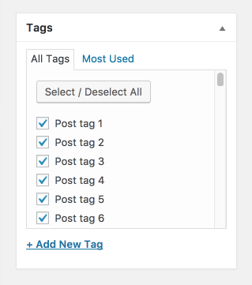

# Post Tag Checklist
Replace the standard post tag meta box on the post edit screen with a category-style checklist. One key benefit over 
the standard post tag meta box is the ability to prevent users (by role, etc.) from adding new post tags.



## Requirements
PHP 5.4+

## Installation
Download the zip file and install it using the WordPress plugin installer.

## Usage
Once installed this plugin will automatically convert the post tag meta box to the category-style checklist. This 
behavior can be changed by filtering `'post_tag_checklist_toggle'`:

```php
<?php
/**
 * Show standard post tag meta box to users who have the 'manage_post_tags' capability.
 *
 * @param bool   $render_checklist Whether or not to render the post tag checklist. Default is true.
 * @param array  $args             Array of arguments for the taxonomy.
 * @param string $taxonomy         Taxonomy name.
 * @return bool
 */
add_filter( 'post_tag_checklist_toggle', function( $render_checklist, $args, $taxonomy ) {
	if ( current_user_can( 'manage_post_tags' ) ) {
		return false;
	}
	
	$render_checklist;
}, 10, 3 );
```
